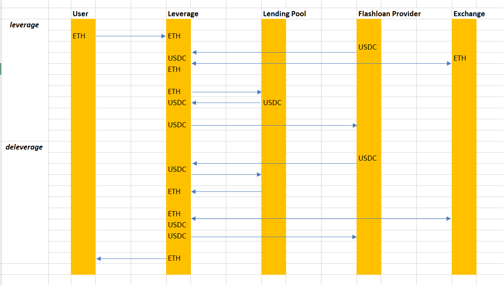

# Flashloan Leverage

## Description

[Here](https://polynomial.slite.page/p/W1xY8-yWCQwbE3/Flashloan-Leverage) is the description


## Assignment

Due to USDC address on Goerli is different in Uniswap and AAVE, I've decided to test with Mock contracts.
Currently, smart contract and minimal test code is done. I will deploy and test them on Goerli later.

## Scripts

### Test
```
yarn test
```

### Deploy (Mock version on Goerli testnet)
```
yarn deploy:mock
```

## Contracts
```
Factory: 
contracts/v-simple/SimpleFactory.sol
Leverage: 
contracts/v-simple/SimpleLeverage.sol
```

## Deployments (Goerli testnet)

|Contract|Address|
|---|---|
|SimpleFactory|0xBc26FE49b6C19eE7D15BD1C33406201C5F659a23|
|SimpleLeverage|0xedEB0500Ab4CaD27749Acf7244eDCfaee4E55410|
|MockToken (USDC)|0xA058224aFCFE2875896c77c5304Df151b97544c8|
|MockWETH (For AAVE)|0x89E6098F06371F505983669a20f70903C50Ccdb5|
|MockWETH (For Uniswap)|0x4223FCAdf62052f469fc3A88d5E7e1bA846551Ab|
|MockAAVEPool|0x4859da93158511fB8A645C9a4a8D932e14F0FD73|
|AaveProvider|0xA3Dbf03F6662747a7cd6D051fe2c614acEa7C90d|
|MockUniswapV3Pool|0x26fD03E9cC04162837Bc120608636436802b871D|

### Simulated Transactions
Leverage:
https://goerli.etherscan.io/tx/0x97ea8f075eaf95b45f7e6cbdf2317e6c75fad08ef21710a67b2ec0c75ceb039b
Deleverage:
https://goerli.etherscan.io/tx/0x2dc3651b7431d32aef8564606243318b5d503d7aaf365fb3111c3ca8366222ff
